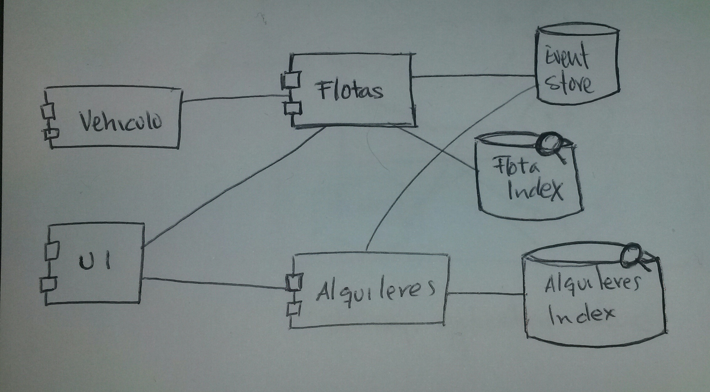

# Objetivos

El proyecto **onDaWay** tiene tres objetivos principales: 

  - Aprender metodologías de diseño de software como *Domain Driven Design* (*DDD*), *Event Sourcing*, *CQRS*, etc. 
  - Aprender nuevas técnicas de programación Java (*streams*, programación reactiva, etc) y aprender/mejorar los conocimientos en Go.
  - Construir un esqueleto/prueba de concepto de un sistema de *car sharing/car pooling*.

A continuación se describle la solución a construir.

# OnDaWay

## Definición

OnDaWay (On the way, De camino) es una solución de gestión de una'flota de vehículos explotada en los modos [carsharing](https://es.wikipedia.org/wiki/Pr%C3%A9stamo_de_veh%C3%ADculos) y [carpooling](https://es.wikipedia.org/wiki/Uso_compartido_de_autom%C3%B3vil).

Existen dos módulos cliente: vehículos y UI.

## Decisiones

Algunas de las partes se programarán en **Java 8**, y la JVM como entorno de ejecución. El equipo tiene experiencia, y se quieren aprender nuevas técnicas de programación Java. Otras partes se programarán en **Go**, aprender y mejorar es otro de los objetivos. Alternativas son Scala, Javascript/Node.io, y otros muchos más.

Se va a utiliza REST como arquitectura para las "operaciones" de cambio de estado del sistema y [GraphQL](http://facebook.github.io/graphql/) como sistema para las operaciones de lectura. Se evaluó hacer todo REST, pero como uno de los objetivos es aprender nos decantamos por añador la capa GraphQL para las consultas. Alternativas: 

  - ProtoBuff: Lo tenemos el el radar de cosas que se podrían incorporar, pero sería meter doble incertidumbre en algunos módulos (dos cosas nuevas). Será una de las primeras cosas a incluir en evoluciones.
  - SOAP: Complejo y orientado a la integración de sistemas.
  - XML/JSON over HTTP: No estandar. Reduce interoperabilidad

Habrá un índice de búsqueda y gestión centralizada de logs, pero se decidirá en el __último momento responsable__.

## Pendiente

  - Decidir *Event Store*

## Preocupaciones

No tenemos seleccionado *Event Store*.

El sistema ha de ser *near real tîme*, y para esto dependemos de que el sistema de gestion de eventos, y la generación de proyecciones sean lo suficientemente rápidas.

En principio todos los sistemas pueden escalar horizontalmente o se van a construir para que escalen horizontalmente. 

## Asunciones

  1. Asumimos que con el *Event Store* que seleccionemos seremos capaces de generar fácilmente las proyecciones necesarias.
  2. El sistema es consistente eventualmente (*eventual inconsistency*4) en operaciones de lectura y consistente en las operaciones de escritura

## Riesgos

  1. Lucene may not be able to handle billions of documents [6x9]
  2. Social platforms will ban our requests [8x9] 

El primer núimero entre corchetes es la probabilidad y el segundo el impacto, en una escala de 0 a 9. Si ambos números son 9 no es un riesgo; es un hecho. Si ambos números son 0, simplemente se puede ignorar este riesgo.

## Listado de tecnologías involucradas

  - Entornos de ejecución y sistemas
    - [Docker](https://www.docker.com/)
    - [JVM](http://java.com)
    - Event store [PENDIENTE de seleccionar]
    - Índice de búsqueda y logs [PENDIENTE de seleccionar]
  - Lenguajes de programación
    - [Java](http://java.com)
    - [Go](https://golang.org/)
  - Especificaciones, metodologías, arquitecturas, etc
    - DDD
    - Event sourcing
    - CQRS
    - REST
    - GraphQL
